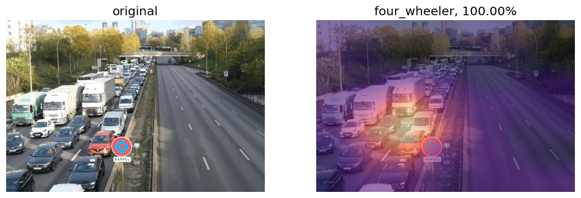

## Project Overview (Test Live Here : [HF_LINK](https://huggingface.co/spaces/AmitPress/trds_preinterview_task)

#### Applications
Here we have two working examples of AI applications. One is a web application and other is a desktop application. Both are very minimal and not
production ready and don't claim to be. But both of them are nice enough for a minimal viable concept product. These two prototypes illustrates the capability of the models that are created.

You can access the live inference app in the `apps/live_inference_app` folder. Please head to there and read the `readme.md` file for a clear picture. Again, you can find the web app `apps/huggingface_space_app` that is also deployed in the 🤗spaces. But you can run it locally as well.

#### Dataset
The dataset is totally handcrafted. I have feteched the data from the internet and make the full datasets for consumption in both the yolo and resnet model.
Please head to the datasets folder and have some more idea on that and please read the `reports/dataset.pdf` for more depthwise understanding.

#### Codes
There are 3 types of code snippets. One is for utility workings like preprocessing or insights derivations. Other two are for training and inference.
You can find the training, inference and preprocessing code at `source_codes` folder. Please read the readme.md file there to have a better picture.

#### Reports
The reports folder have the below products,
- Report on dataset
- Report on training and testing the models
- Report on background studies

#### Reference Papers
The `reference_papers` folder holds the literatures that are being reviewed in the background studies report. So, the folder is only for the resources.

Please let me know if anything went incomprehensible. I will try to clearify that as well.
