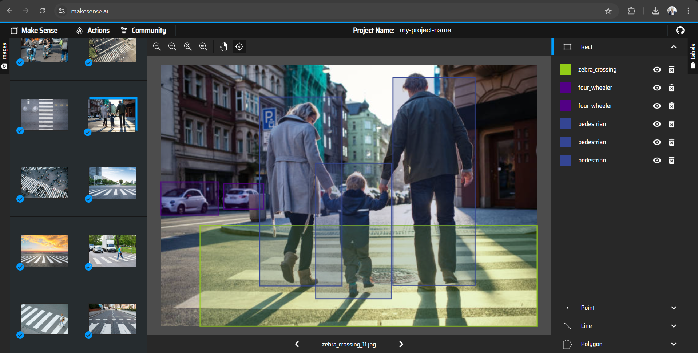

#### Preparing Dataset and Data preprocessing
I have gather data in 10 different categories which are mention in `datasets/labels.txt` file. So, as I were told to work with only 150 images, I , carefully collected data for each class of size just more than 15 so that I can resample the data after. In terms of collecting data I have scraped photos from istock, shutterstock, getty etc sites. In this sites the photos were freely available with a generous tier of being a member only. So, I exploited that in an ethical way. After I collected the date, I had made sure the there only 15 photos in each class. For that, I created corresponding functions that enabled me to automate the whole process by myself. You can find the functions at `datasets/preprocessing.ipynb` file. So, with the help of my created script, I generated the base vanilla dataset where all the categories have their own folder name after each of them. This way I got a generic format to work on. And I used that for training the RESNET50 model. And for training the YOLO model, YOLO requires a specific format that I have achieved through scripting the python file manually. And it also needed an configuration file called `data.yml` to have the meta information about the data itself.

As you can see, for YOLO you need to have YOLOs own format of annotation where labels are annotated in `.txt` format. I have used a very good free tool called `makesense.ai` which I have used previously as well and got good result.