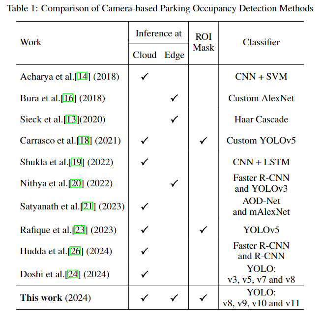

#### Background Studies:
You Only Look Once is a now SOTA object detection algorithm developed in 2015 by Redmon. Since then, the model has evolved year after year and become more efficient and applicable to modern scenario. We have gone through a recent paper with the Title "YOLOv8 to YOLO11: A Comprehensive Architecture In-depth Comparative Review" from Hidayatullah et al[1]. In this paper they have thoroughly studied the recent extensions to the main idea of YOLO and compared them side by side. They examined the performance and efficiency of the model and made sure they have put a clear insight about the behind the scene working technique of each module. They explained the architecture block of each model since YOLOv8. They explained Basic Convolutional Block, Downsampling Block to Advanced C2f block, SPPF and SPPELAN blocks. Which are the backbone of each respected architectures. They finally urge the future YOLO developer to provide insights of their working by publishing papers and materials in public discourse. 
In our next paper, we read about the application of YOLO in terms of vehicle detection for smart parking systems. The paper is titled "Smart Parking With Pixel-Wise Selection for Vehicle Detection using YOLOv8, YOLOv9, YOLOv10 and YOLOv11 by Gustavo, Sato et al[2]. They showed the system paving the future of smart city. In terms of urbanization they urgued that the use of AI technology is a key actor. They have explained the nitty gritties of each architecture and did a very rigorous testing and comparison. In their paper, they covered all the underlying methods that the respected YOLO architectures use and they also give some insightful idea about them in terms of such application development. Finally, after such rough benchmarking they decided to go with YOLOv9 considering the performance and cost effectiveness of the model itself. They also argued that YOLO applications are quite good in edge devices and they have shown they could achive nice result with it. Again, they have used a Raspberry PI 5 module and have talked about testing on NVIDIA JETSON NANO machine.
 As you can see in the picture they could achieve such good result where they are the only one who could run the model in cloud and edge with Region of Interest (ROI) mask.

In our third and final paper, we have reviewed a recent cutting edge YOLO extension called MAMBA YOLO of the paper called "Mamba YOLO: A Simple Baseline for Object Detection with State Space Model" by Wang, Li et al[3]. As the name suggests the paper talks about incorporating State Space Model to have more control over Residual Block Model. They have tried to use Natural Language Processing Models in Vision Learning. They have talked about ViT as their primary interest. And they restudied the CNN block structures and they considered the Gated Residual Blocks or RGBlock. They tweaked that and come up with the idea of their own. They compared their baseline model with other YOLO architectures and found that to be a viable and usable baseline model that can be go hand in hand with other model. They also open sourced their work at [github/mamba_yolo](https://github.com/HZAI-ZJNU/Mamba-YOLO).

References:
1. YOLOv8 to YOLO11: A Comprehensive Architecture In-depth Comparative Review. Priyanto, Nurjannah et al. January 23, 2025.
2. SMART PARKING WITH PIXEL-WISE ROI SELECTION FOR VEHICLE DETECTION USING YOLOV8, YOLOV9, YOLOV10, AND YOLOV1. Gustavo, Sato et al. December 10, 2024.
3. Mamba YOLO: A Simple Baseline for Object Detection with State Space Model. Wang, Li et al. December 14, 2024.
