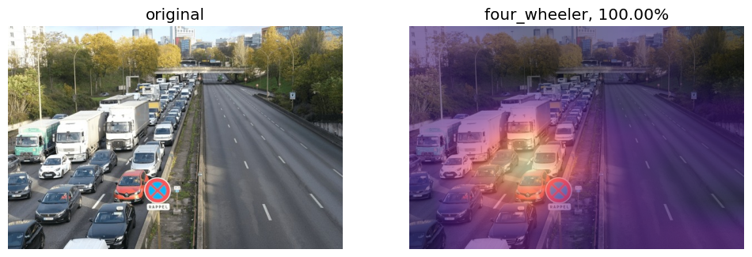

#### Training and Evaluating Model
For training our model, with the specific dataset that we have gather till now. I have use FastAI python package by Jeremy Howard a renowned AI advocate and developer. This module helped me for Rapid Prototyping of my model. And the best part is that this module is extensible and people have contributed to its extension in a very gracious and grandior manner. So, I got fully support for various training tools such as GradCAM. GradCAM allowed me to understand where my model is putting its focus. Later on, I could change some settings and tuing some configurations I could bring on better result.

As you can see the gradcam could tell me where the model is focusing. And by tuning and checking the model I can shift the focus around and attain my goals eventually.

And in terms of YOLOv8 model, I have used `ultralytics` for training and inference. The training was quite straightforward and simple. As they have abstracted away most of the difficulties with their cli tool.
```python 
from ultralytics import YOLO
model = YOLO("yolov8x.pt")
model.train(data="/kaggle/input/road-transport-dataset-yolo-v2/road_transport_dataset_yolo/data.yml", epochs=120)
```
As you can see by only these three lines and some wit, you can easily train the model.

And for inference, you can load the model and perform inference as directed in their niffty documentation page.
For local file inference I prefer,
```sh
!yolo task=detect mode=predict model="./best.pt" source='demo.mp4' show=False save=True
```
The `demo.mp4` is available at `apps/live_inference/artifacts` folder. Do check it once.


Again, you can find the metrics related to training in the `resources/yolo` folder.